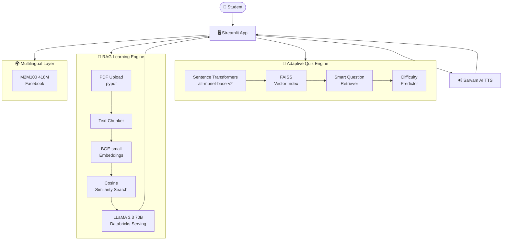

# 🌉 Vidya Setu — AI-Powered Adaptive Learning Platform

<div align="center">
Adaptive quiz engine · 10 Indian languages · RAG-powered tutoring · Accessibility-first

[🚀 Quick Start](#-setup--run) · [🎮 Demo](#-demo-walkthrough) · [✨ Features](#-features) · [🏗️ Architecture](#-architecture)

</div>

---

## 📖 What is Vidya Setu?

**Vidya Setu** (Bridge of Knowledge) is an AI-powered learning platform that bridges gaps in education—empowering disabled and underserved learners with adaptive quizzes and a RAG-based tutor that understands their study material and responds in their language and learning style.

It combines a **ML-powered adaptive quiz engine** with a **RAG-based personal tutor** that reads your study material and answers questions in your language, adapted to your accessibility needs.

> 🏆 Built for the **Databricks Hackathon 2026** — demonstrating real-world AI for social good in Indian education.

---

## ✨ Features

| Feature | Description |
|---|---|
| 🧠 **Adaptive Quiz Engine** | FAISS + Sentence Transformers select questions by difficulty and weak topics |
| 📈 **Real-time Difficulty Adjustment** | Automatically upgrades Easy → Medium → Hard based on performance |
| 🌍 **10 Indian Languages** | English, Hindi, Tamil, Telugu, Bengali, Marathi, Gujarati, Kannada, Malayalam, Punjabi |
| 🔊 **Text-to-Speech** | Sarvam AI reads questions and answers aloud in your chosen language |
| 📄 **RAG-Based PDF Tutor** | Upload any textbook/notes → ask questions → get cited answers |
| ♿ **Accessibility Profiles** | Adapted outputs for ADHD, Dyslexia, Visual Impairment, Hearing Impairment |
| 📊 **Live Analytics Sidebar** | Topic mastery, difficulty breakdown, accuracy, and focus recommendations |
| 🎯 **Source Citations** | Every RAG answer cites the exact page number from your PDF |

---

## 🏗️ Architecture



---

## 🛠️ Tech Stack

### 🤖 AI / ML
| Component | Technology |
|---|---|
| Large Language Model | LLaMA 3.3 70B via Databricks Model Serving |
| Quiz Embeddings | `sentence-transformers/all-mpnet-base-v2` |
| RAG Embeddings | `BAAI/bge-small-en-v1.5` |
| Vector Search | FAISS (IndexFlatIP) |
| Translation | Facebook M2M100 418M |
| Text-to-Speech | Sarvam AI Bulbul v3 |

### 🏗️ Platform & Infrastructure
| Component | Technology |
|---|---|
| Deployment | Databricks Apps |
| Model Serving | Databricks Model Serving Endpoints |
| Frontend | Streamlit |
| PDF Processing | pypdf |

---

## 🚀 Setup & Run

### Prerequisites
- Python 3.9+
- Databricks workspace with Model Serving enabled
- Sarvam AI API key ([get one here](https://sarvam.ai))

### 1. Clone & Install

```bash
git clone https://github.com/abhishek130904/DatabricksHackathon.git
cd DatabricksHackathon
pip install -r requirements.txt
```

### 2. Configure API Keys

Edit `app.py` and set your credentials:

```python
# Databricks (auto-configured inside Databricks Apps)
DATABRICKS_HOST  = "https://<your-workspace>.azuredatabricks.net"
DATABRICKS_TOKEN = "your_databricks_token"

# Sarvam AI
SARVAM_API_KEY = "your_sarvam_api_key"
```

> 💡 Inside Databricks Apps, authentication is handled automatically — no token needed.

### 3. Run Locally

```bash
streamlit run app.py
```

App opens at `http://localhost:8501`

### 4. Deploy on Databricks Apps

```bash
# Import project to Databricks workspace
databricks workspace import-dir . /Workspace/Users/<your-email>/vidya-setu
```

Then in the Databricks UI:
1. Navigate to **Databricks → Apps**
2. Click **Create App**
3. Select `/Workspace/Users/<your-email>/vidya-setu`
4. Set environment variables (`SARVAM_API_KEY`)
5. Click **Deploy** — allow **8–10 minutes** for large ML models to load

---

## 🎮 Demo Walkthrough

### 🧠 Demo 1: Adaptive Quiz Engine

```
1. Open app → Select subject (Physics / Math / Chemistry)
2. Answer 3 easy questions correctly
3. Watch difficulty auto-upgrade: EASY → MEDIUM
4. Switch language to Hindi using the Language dropdown
5. Click 🔊 "Read Aloud" — hear the question in Hindi
6. Check sidebar → see Topic Mastery and Weak Topic focus update live
```

### 📄 Demo 2: RAG-Powered Personalized Learning

```
1. Click "Personalized Learning" tab
2. Upload any PDF (textbook chapter, lecture notes, etc.)
3. Select Accessibility Profile → "ADHD"
4. Ask: "What is the main concept in this document?"
5. Observe: answer broken into numbered steps (ADHD adaptation)
6. Click 🔊 "Listen" — audio plays with duration shown
7. Expand 📚 Sources → see exact page numbers cited
8. Switch profile to "Dyslexia" → ask again → notice simpler language
```

### ⚡ Demo 3: Quick Prompts to Impress Judges

```
"Explain Newton's Laws in simple terms"
"What are the key formulas mentioned in this chapter?"
"Summarize the important points from page 3"
"Give me a step-by-step explanation of this concept"
```

---

## 📁 Project Structure

```
vidya-setu/
├── app.py                 # Main Streamlit application
├── pcmDataset.csv         # Physics/Chemistry/Math quiz dataset
├── requirements.txt       # Python dependencies
├── app.yaml               # Databricks Apps configuration
└── README.md
```

---

## 🐛 Troubleshooting

| Issue | Fix |
|---|---|
| `LLM endpoint not found` | Run `pip install --upgrade databricks-sdk` and verify endpoint name |
| `TTS returns 0:00 duration` | Raw PCM is auto-wrapped in WAV header — ensure `speech_sample_rate: 8000` in payload |
| `Translation model slow` | M2M100 loads once and is cached — wait for first load (~2 min) |
| `Slow startup (8–10 min)` | Normal — large ML models (M2M100, Sentence Transformers) load on cold start |
| `PDF embeddings fail` | Ensure `pypdf` and `sentence-transformers` are installed; try a text-based PDF |
| `FAISS import error` | Run `pip install faiss-cpu` (or `faiss-gpu` on GPU instances) |

---

## 📦 requirements.txt

```txt
streamlit>=1.32.0
pandas
numpy
sentence-transformers
faiss-cpu
scikit-learn
transformers
torch
pypdf
databricks-sdk
requests
```

---

## ♿ Accessibility Profiles

| Profile | Adaptation Strategy |
|---|---|
| 🔵 **Default** | Balanced explanation with examples |
| 👁️ **Visual Impairment** | Rich text descriptions, no visual references, full verbal context |
| 👂 **Hearing Impairment** | Complete written output, no audio-dependent phrasing |
| 📖 **Dyslexia** | Short sentences, simple vocabulary, bullet points |
| 🧠 **ADHD** | Numbered steps, concise chunks, high-focus structure |

---

## 🌍 Supported Languages

| Language | Native Script | TTS Support |
|---|---|---|
| English | English | ✅ |
| Hindi | हिंदी | ✅ |
| Tamil | தமிழ் | ✅ |
| Telugu | తెలుగు | ✅ |
| Bengali | বাংলা | ✅ |
| Marathi | मराठी | ✅ |
| Gujarati | ગુજરાતી | ✅ |
| Kannada | ಕನ್ನಡ | ✅ |
| Malayalam | മലയാളം | ✅ |
| Punjabi | ਪੰਜਾਬੀ | ✅ |

---

## 👨‍💻 Contributors

<table>
  <tr>
    <td align="center">
      <b>Abhishek Raj</b><br>
      IIT Indore<br>
      <a href="https://github.com/abhishek130904">@abhishek130904</a>
    </td>
  </tr>
</table>

---

## 📄 License

Open-source for educational purposes. Built for **Databricks Hackathon 2026**.

---

<div align="center">

**If Vidya Setu helped you, please ⭐ star the repo!**

[](https://github.com/abhishek130904/DatabricksHackathon)

*Bridging knowledge gaps with AI — one student at a time.*

</div>
